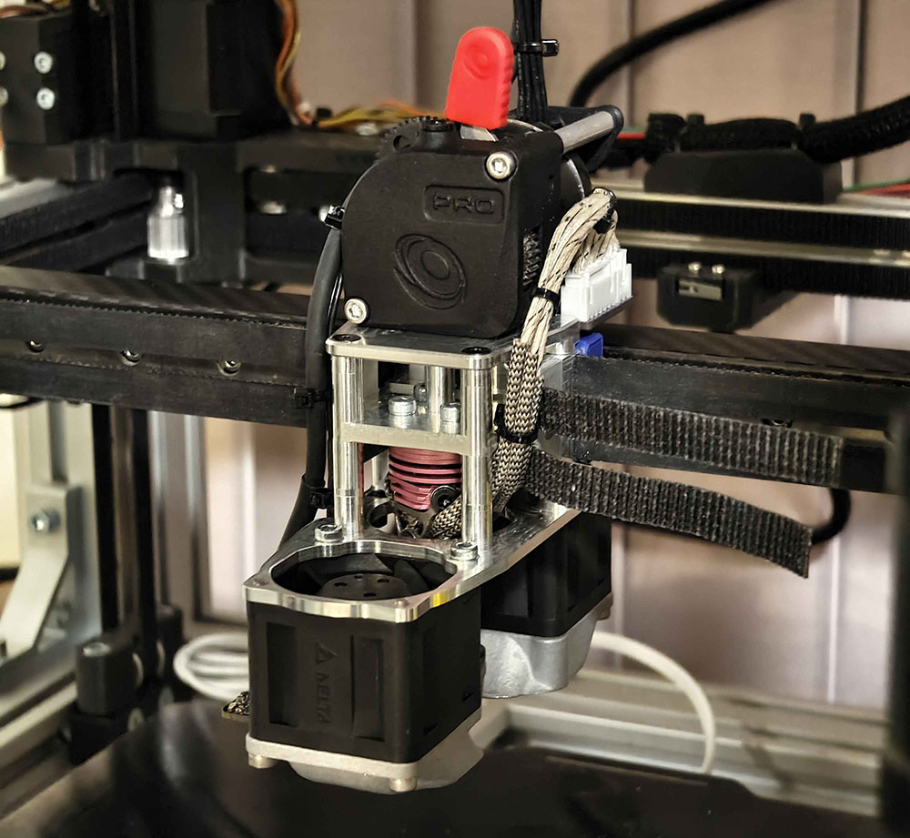
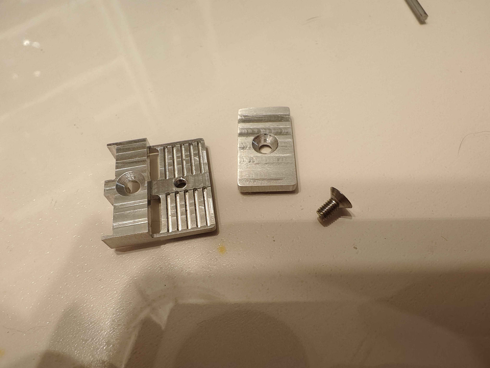
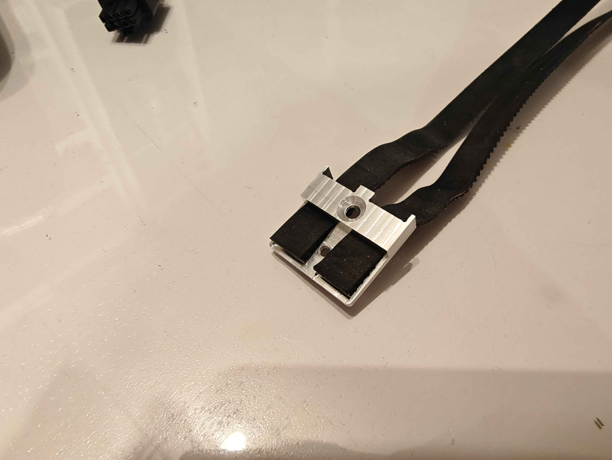
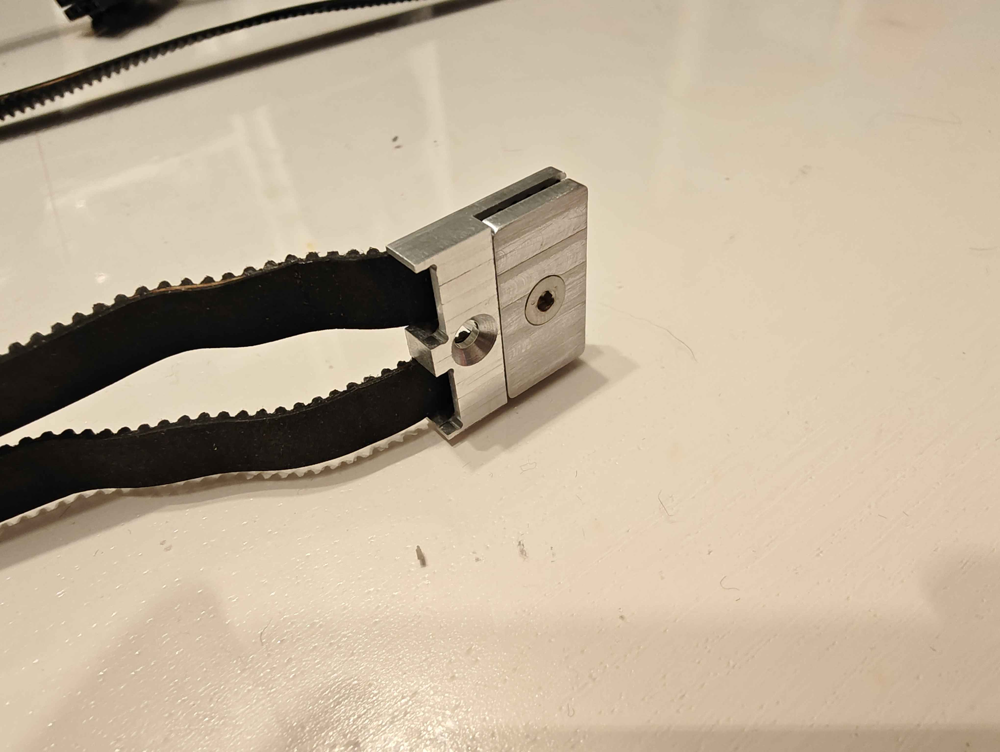
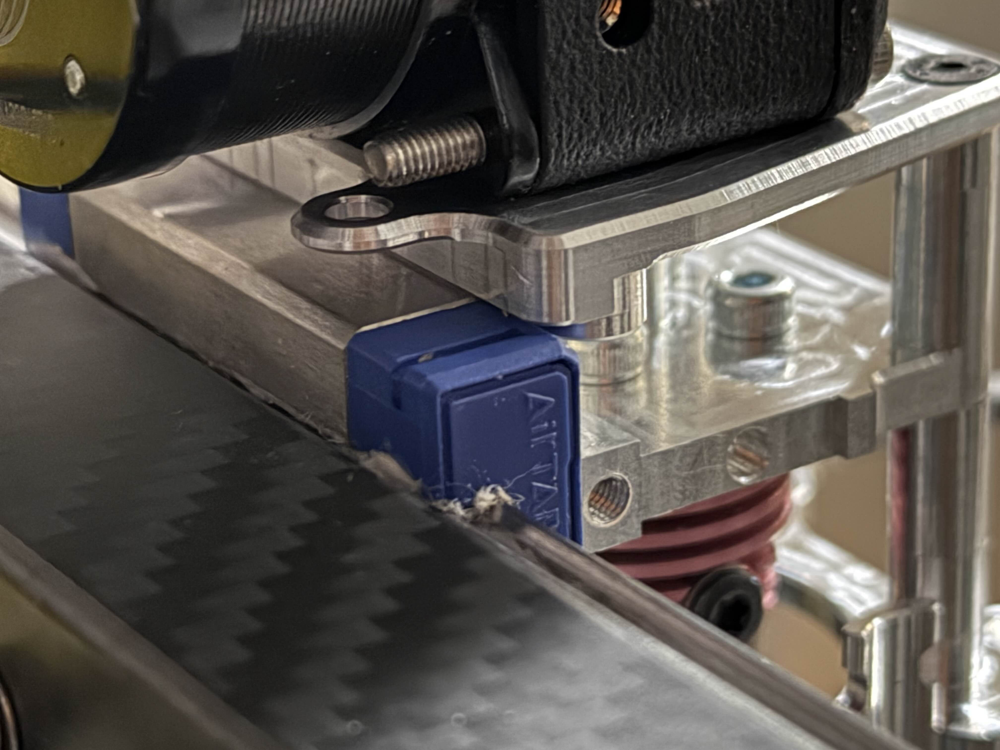

# Carveoff

Carveoff is a toolhead based on [Takeoff Toolhead](https://github.com/Kizime123/Takeoff-Toolhead), designed to be milled rather than printed with SLM.

---

## Features

### Removable Belt Clips

Belt clips are easily removable, making servicing much easier.

  

### Easily detachable toolhead 

The toolhead mounts and unmounts without any disassembly of the carriage or wiring harness.

| Attach | Detach |
|--------|--------|
|  |  |

---

### Rail Alignment

Alignment feature that mates with the linear rail carriage to ensure the toolhead is installed straight.

---

## Requirements

- 9 mm inverted belt path, 4 mm spacing — [Monolith Gantry](https://github.com/Monolith3D/Monolith_Gantry)
- SLM ducts — Takeoff ducts fit, however there are new and improved ducts included in this repo which you should use.
- [Beacon](https://beacon3d.com/product/beacon-h/)

---

## Compatibility

### Hotends

- [Tricorn](https://github.com/tricornhotend/tricornhotend.com)
- [Chube](https://chubehotend.com/)
- [Goliath](https://github.com/VzBoT3D/Goliath)

### Extruders

- LGX Lite and mechanically similar extruders
- [Sherpa Mini](https://github.com/Annex-Engineering/Sherpa_Mini-Extruder)
- [Sherpa Micro](https://github.com/Annex-Engineering/Sherpa_Micro-Extruder)
- [Orbiter](https://www.orbiterprojects.com/orbiter-v2-5/)

---

## License

Licensed under the [GNU General Public License v3.0](LICENSE).

---

## Acknowledgements

- Burgo for the name "Carveoff"
